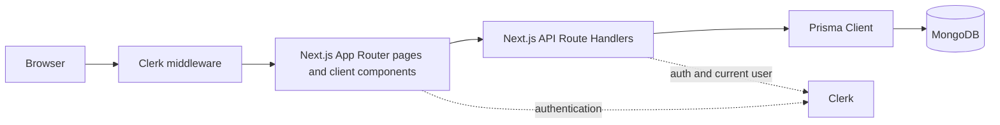

# Forms4U

Forms4U is a full-stack form builder for creating, publishing, and managing dynamic forms. It supports sectioned forms, multiple question types, quiz workflows, response collection, and token-based response editing.

**Live Demo:** [https://myforms4u.vercel.app/](https://myforms4u.vercel.app/)

**GitHub Repository:** [github.com/SambhavSharma7781/myforms4u](https://github.com/SambhavSharma7781/myforms4u)

## Overview

Signed-in users manage their forms from a dashboard, build forms with questions and sections, configure behavior, preview drafts, and publish forms. Published forms are rendered through a public route where respondents can submit answers without signing in. Owners can review or delete responses, while eligible non-quiz responses can be edited through a time-limited token link.

## Features

### Form Builder

- Create, edit, rename, publish, unpublish, and delete forms.
- Save drafts and preview a form before publishing.
- Search the signed-in user's forms by title.
- Edit form titles and descriptions with a rich-text editor.

### Question Types

- Short answer
- Paragraph
- Multiple choice
- Checkboxes
- Dropdown
- Required questions, options, question images, option images, and per-question option shuffling.

### Sections

- Create, edit, delete, and reorder sections.
- Keep at least one section in every form.
- Navigate public forms section by section with progress information.

### Quiz and Scoring

- Enable quiz mode and assign points and correct answers to questions.
- Score multiple choice and checkbox questions.
- Apply word-based partial scoring to short-answer and paragraph questions.
- Store submitted total and maximum scores with response answers.
- Configure whether correct answers and grades are shown.

### Response Management

- Collect responses through published public forms.
- Optionally collect an email address.
- View responses and their answers from the owner editor.
- Delete all responses for a form.
- Enable response editing for non-quiz forms with `24h`, `7d`, `30d`, or `always` token limits.

### Authentication and Customization

- Clerk sign-in and sign-up flows.
- Owner-only form management and response access.
- Form settings for question order, required defaults, progress display, confirmation messages, response behavior, quiz behavior, and theme color/background.

## Tech Stack

| Area | Technologies |
| --- | --- |
| Frontend | Next.js 15 App Router, React 19, TypeScript |
| Backend / APIs | Next.js Route Handlers, Prisma Client |
| Database | MongoDB through Prisma ORM |
| Authentication | Clerk via `@clerk/nextjs` |
| UI | Tailwind CSS 4, Radix UI, Lucide React, shadcn-style UI primitives |
| Deployment | Vercel |

## Architecture

The application uses Next.js App Router pages and client components for interactive form editing and response rendering. API Route Handlers perform authentication, ownership checks, validation, and Prisma operations. Prisma is configured with MongoDB through `DATABASE_URL`.



Owner pages such as `/forms/create` and `/forms/[id]` use client-side state and fetch the owner APIs. Public form pages use `/api/forms/[id]/public` and `/api/forms/[id]/submit`; the response-editing page uses a token instead of Clerk authentication. Forms contain ordered sections, sections contain questions, questions contain options and answers, and responses contain the submitted answers.

## Data Model

The Prisma schema defines **7 models** and one `QuestionType` enum:

- `User`: Clerk-linked user with owned forms and associated responses.
- `Form`: title, publication and response state, settings, sections, and responses.
- `Section`: ordered section belonging to a form and containing questions.
- `Question`: question text, type, required state, images, quiz fields, options, and answers.
- `Option`: selectable text/image belonging to a question.
- `Response`: one form submission, optional email, quiz totals, edit token data, and answers.
- `Answer`: text or selected options for a question, plus optional quiz result fields.

Relationships are one-to-many from `User` to `Form`, `Form` to `Section` and `Response`, `Section` to `Question`, `Question` to `Option` and `Answer`, and `Response` to `Answer`. A response may optionally reference a user, which allows anonymous submissions.

## API Overview

The repository contains **16 API route files** and **21 exported HTTP handlers** under `app/api/`.

| API group | Routes and purpose |
| --- | --- |
| Form lifecycle | `POST /api/forms/create`, `PUT /api/forms/update/[id]`, `GET`/`PUT /api/forms/[id]`, `PATCH /api/forms/[id]/publish`, `PATCH /api/forms/[id]/toggle-responses`, `PATCH /api/forms/rename/[id]`, `DELETE /api/forms/delete/[id]` |
| Form discovery | `GET /api/forms/user` lists the signed-in user's forms; `GET /api/forms/search` searches owned form titles |
| Sections | `POST`/`PATCH`/`DELETE /api/forms/sections`; `POST /api/forms/sections/reorder` |
| Public forms | `GET /api/forms/[id]/public` returns published form data; `POST /api/forms/[id]/submit` validates and stores a response |
| Settings | `PUT /api/forms/[id]/settings` updates form settings |
| Responses | `GET`/`DELETE /api/forms/[id]/responses` retrieves or removes owner responses; `GET`/`PUT /api/forms/[id]/responses/[token]` reads or updates a token-authorized response |

The `/api/forms/[id]` `PUT` handler is retained as a legacy form replacement path; the editor uses the section-aware update route for current form updates.

## Authentication and Authorization

Clerk is mounted in the root layout and used by `middleware.ts`, the sign-in/sign-up pages, and API handlers. Middleware protects form creation and form-management paths while allowing public `/view` pages and `/edit-response` pages to load without a Clerk session.

Owner APIs call Clerk `auth()` and compare the authenticated user ID with the form's `createdBy` value, or use an equivalent ownership filter. The create route creates the corresponding local `User` record from Clerk data when needed. Public form retrieval and submission do not require authentication. Submitted responses currently leave `userId` unset, so authenticated and anonymous respondents are not associated with a local user record.

## Quiz and Scoring

Scoring is implemented in the client component at `app/forms/[id]/view/page.tsx`:

- Multiple choice is correct when the selected value is in `correctAnswers`.
- Checkboxes require an exact set match with `correctAnswers`.
- Short answers use normalized, punctuation-stripped word matching and proportional points.
- Paragraph answers use the same matching with threshold bands of 100%, 80%, 60%, 30%, or 0% of the question points.
- Dropdown questions currently receive zero points because they have no scoring branch.
- `maxScore` is the sum of every question's `points`, including questions that are unsupported or unanswered by the scoring switch.

The client sends `totalScore`, `maxScore`, and per-question quiz results to `/api/forms/[id]/submit`. The submit handler stores those values but does not re-grade or verify them server-side.

## Getting Started

### Prerequisites

- Node.js and npm
- A MongoDB database
- A Clerk application with sign-in and sign-up enabled

### 1. Clone and install

```bash
git clone https://github.com/SambhavSharma7781/myforms4u.git
cd myforms4u
npm install
```

`npm install` runs the Prisma `postinstall` generation step.

### 2. Configure environment variables

Copy the example file and replace the placeholders with values from MongoDB and Clerk:

```bash
cp .env.example .env.local
```

The required names and purposes are listed below. Do not commit `.env.local` or other files containing secrets.

### 3. Prepare the database

Push the Prisma schema to the configured MongoDB database:

```bash
npx prisma db push
```

### 4. Run the development server

```bash
npm run dev
```

Open [http://localhost:3000](http://localhost:3000).

### 5. Build and run production mode

```bash
npm run build
npm run start
```

The build script runs `prisma generate` before `next build`. `npm run lint` runs ESLint separately.

## Environment Variables

| Variable | Purpose |
| --- | --- |
| `DATABASE_URL` | MongoDB connection string used by Prisma. |
| `NEXT_PUBLIC_CLERK_PUBLISHABLE_KEY` | Public Clerk key used by the Clerk client integration. |
| `CLERK_SECRET_KEY` | Clerk server-side secret configured for the application. |
| `NEXT_PUBLIC_CLERK_SIGN_IN_URL` | Clerk sign-in route; the example uses `/sign-in`. |
| `NEXT_PUBLIC_CLERK_SIGN_UP_URL` | Clerk sign-up route; the example uses `/sign-up`. |

## Project Structure

```text
app/
  api/forms/                 Next.js API Route Handlers
  forms/                     Dashboard, builder, editor, preview, and response views
  sign-in/                   Clerk sign-in page
  sign-up/                   Clerk sign-up page
  layout.tsx                 ClerkProvider, navbar, metadata, and app shell
  page.tsx                   Forms dashboard
components/                  Form builder, navigation, response, and UI components
hooks/                       Client hooks such as toast state
lib/                         Shared utilities, including response edit tokens
prisma/schema.prisma         MongoDB Prisma schema
services/prisma.ts           Shared Prisma Client instance
public/                      Static assets
middleware.ts                Clerk route protection
```

## Deployment

Forms4U is deployed on Vercel, with MongoDB used as the database and Clerk used for authentication. The application uses the standard Next.js `build` and `start` scripts and requires the five environment variables listed above.

## Author

**Sambhav Sharma**

- GitHub: [SambhavSharma7781](https://github.com/SambhavSharma7781)
- LinkedIn: [sambhavsharma07](https://www.linkedin.com/in/sambhavsharma07/)
